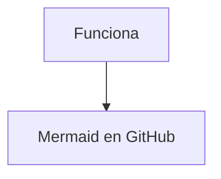

# Práctica 2 – Infraestructura como código.

Para este proyecto se despliega una aplicación web con varias réplicas empleando contenedores **Docker** gestionados por **Terraform**, con dos entornos diferenciados:

- Entorno de **desarrollo (dev)**.
- Entorno de **producción (prod)**.

Incluye:

- Balanceo de carga con un servidor **NGINX**.
- Base de datos **MySQL** para ambos entornos.
- Caché **Redis** para entorno de producción.
- Monitorización con **Prometheus**, **Grafana**, **cAdvisor**.
- Logs centralizados con **Loki** + **Promtail**.
- Alertas al correo electrónico con **Prometheus Alertmanager** en entorno de producción.
- Almacenamiento de ficheros estáticos compartidos con **MinIO**.

---

## Instalación y despliegue de los entornos

### Requisitos

Antes de comenzar, hay quetener instalados:

- **Docker Engine** ≥ 24.x
- **Terraform** ≥ 1.5  
- `make` para usar el Makefile

Comprobación rápida:

```bash
docker --version
terraform version
make --version
```

Clonar el repositorio
```bash
git clone https://github.com/VicenteOgazon/Practica-2-terraform.git
cd Practica-2-terraform
```

### Carpetas necesarias
Será necesario crear una carpeta environments que contenga los archivos **dev.tfvars** y **prod.tfvars** con todas las variables sensibles para cada entorno

## Inicialización del entorno de desarrollo (dev)

### Imagen para entorno de desarrollo
```bash
make build-dev
```
### Inicialización y despliegue del entorno de desarrollo
```bash
make init-dev
make plan-dev
make apply-dev
```

#### Acceso a los servicios

Aplicación web a través del balanceador (dev): 
http://localhost:6060

Panel de Prometheus (dev): 
http://localhost:9090

Panel de Grafana (dev): 
http://localhost:3000

Consola de MinIO (dev): 
http://localhost:9001

## Inicialización del entorno de producción (prod)

### Imagen para entorno de producción
```bash
make build-prod
```

### Inicialización y despliegue del entorno de producción
```bash
make init-prod
make plan-prod
make apply-prod
```

### Acceso a los servicios

Aplicación web a través del balanceador (prod): 
http://localhost:6061

Panel de Prometheus (prod): 
http://localhost:9091

Panel de Grafana (prod): 
http://localhost:3001

Consola de MinIO (prod): 
http://localhost:19001

---
## Descripción de los entornos

### Entorno de desarrollo
El entorno de desarrollo está pensado para facilitar la programación, las pruebas y la depuración de la aplicación manteniendo una arquitectura similar a producción, pero más sencilla y sin requisitos estrictos de alta disponibilidad.
A diferencia del entorno de producción, en desarrollo se despliegan menos réplicas de la aplicación y no se utiliza Redis como caché, centrándose en comprobar la lógica de la aplicación, el acceso a la base de datos y la integración con la monitorización.

Características entorno de desarrollo (Terraform dev):

- Se despliegan dos instancias de la aplicación Flask (`dev_web-0, dev_web-1`) detrás de un balanceador Nginx.
- La aplicación se configura con 'APP_ENV=development' para no utilizar la caché.
- Incluye una base de datos MySQL específica del entorno de desarrollo.
- No se incluye Redis como memoria caché (la lógica de caché está deshabilitada).
- Se despliega MinIO dev con un bucket `static-dev`, desde el que la aplicación consume ficheros estáticos compartidos (en este caso el fondo de la web).
- La monitorización está activa:
    - Prometheus dev scrapea métricas de las instancias web (`/metrics`) y de cAdvisor.
    - Grafana dev permite visualizar CPU y memoria por contenedor.
    - Loki + Promtail permiten consultar logs centralizados desde Grafana (Explore).

### Entorno de desarrollo
El entorno de producción está diseñado para ejecutar la aplicación en un entorno más robusto, con alta disponibilidad, caché y alertas configuradas.
En este caso se despliegan 3 réplicas de la aplicación, se habilita Redis como caché y se refuerza la monitorización para poder detectar y demostrar fallos de los servicios críticos durante la práctica.

Características entorno de producción (Terraform prod):

- Se despliegan tres instancias de la aplicación Flask (`prod_web-0, prod_web-1, prod_web-2`) detrás de un balanceador Nginx, cumpliendo el requisito de alta disponibilidad.
- La aplicación se configura con `APP_ENV=production` para utilizar la caché.
- Incluye una base de datos MySQL de producción.
- Se despliega Redis como sistema de caché en memoria, y la aplicación lo utiliza cuando `USE_CACHE=True`.
- Se despliega MinIO prod con un bucket `static-prod`, desde el que la aplicación consume ficheros estáticos compartidos en producción.
- La pila de monitorización está completamente activa:
    - Prometheus prod recoge métricas de las instancias web y de cAdvisor.
    - Grafana prod muestra dashboards de rendimiento (CPU, memoria, etc.).
    - Loki + Promtail centralizan los logs de los contenedores.
    - Alertmanager prod recibe las alertas de Prometheus y está configurado para enviar notificaciones por correo (por ejemplo, caída de una instancia web, de la base de datos o del balanceador).


| Característica       | Desarrollo                                       | Producción                                          |
| -------------------- | ------------------------------------------------ | --------------------------------------------------- |
| Nº de instancias web | 2 (`dev_web-0`, `dev_web-1`)                     | 3 (`prod_web-0`, `prod_web-1`, `prod_web-2`)        |
| Base de datos        | MySQL dev                                        | MySQL prod                                          |
| Caché Redis          | Deshabilitada                                    | Activada y usada por la aplicación                  |
| Balanceador          | Nginx dev sin requisitos de alta disponibilidad  | Nginx prod con alta disponibilidad web              |
| MinIO                | Bucket `static-dev` para estáticos de desarrollo | Bucket `static-prod` para estáticos de producción   |
| Monitorización       | Prometheus + Grafana + cAdvisor + Loki/Promtail  | Igual que dev                                       |
| Alertmanager         | No desplegado                                    | Desplegado, con envío de alertas por correo         |
| Objetivo principal   | Desarrollo y pruebas de integración              | Despliegue con alta disponibilidad, caché y alertas |


### Pruebas end-to-end (E2E)

Se ha implementado un comando **make test-e2e** que ejecuta un test automático sobre el entorno indicado (dev o prod). El test asume que el entorno ya está levantado con Terraform.

Durante su ejecución realiza:

- Extrae la URL del balanceador desde los outputs de Terraform.

- Obtiene el número de réplicas esperadas desde Terraform y valida cuántas réplicas están en el balanceador.

- Comprueba que el tráfico se redirige entre distintas réplicas por el método Round-Robin.

- Accede a MinIO y lista el contenido del bucket del entorno, static-dev o static-prod.

- Hace una petición al enpoint /usuarios/json y verifica el funcionamiento de la caché mediante la cabecera X-Cache:

    - En dev se espera NO_CACHE

    - En prod se espera NOT_FROM_CACHE en la primera petición y FROM_CACHE en la segunda

Uso del test
```bash
# Test contra dev
make test-e2e ENV=dev

# Test contra prod
make test-e2e ENV=prod
```

### Coste mensual simulado en AWS

Al ejecutar terraform **make apply-dev/prod**, Terraform muestra en los outputs un resumen de coste mensual aproximado, simulando el despliegue en AWS EC2 On-Demand en la región eu-south-2.

El cálculo se basa en:

- 1 instancia t3.micro por réplica web.

- 1 instancia t3.small para MySQL.

- 1 instancia t3.micro para LB.

- 1 instancia t3.micro para MinIO.

- 1 instancia para monitorización (dev micro / prod small).

- 1 instancia t3.micro para Redis (solo prod).

Aproximación de 730 horas/mes.

El output mostrado es **cost_monthly_summary**.


---
## Estructura del proyecto
```bash
├── app/
│   ├── __init__.py                 # create_app(), carga config por entorno, registra blueprints y métricas
│   ├── __main__.py                 # punto de entrada: python -m app
│   ├── routes.py                   # rutas (/, /usuarios/json con X-Cache, /health, /instance, /crash, etc.)
│   ├── cache.py                    # lógica Redis (solo prod, si USE_CACHE=True)
│   ├── config.py                   # Config, DevelopmentConfig, ProductionConfig
│   ├── templates/
│   │   ├── index.html              # UI principal
│   │   └── status.html             # página de estado
│   └── static/
│       └── style.css               # estilos CSS
│
├── dockerfile/
│   ├── dev_Dockerfile              # imagen Flask para dev
│   ├── prod_Dockerfile             # imagen Flask para prod
│   ├── dev_requirements.txt        # dependencias Python dev
│   ├── prod_requirements.txt       # dependencias Python prod
│   └── .dockerignore
│
├── infra/                          # Terraform unificado (workspaces dev/prod)
│   ├── main.tf                     # root module: llama a módulos (web, db, lb, monitoring, storage, cache condicional, etc.)
│   ├── variables.tf                # variables comunes para dev y prod
│   ├── outputs.tf                  # outputs (lb_url, web_replicas, minio_bucket, minio_api_port, etc.)
│   ├── cost.tf                     # cálculo de coste mensual simulado EC2 On-Demand eu-south-2 (output cost_monthly_summary)
│   ├── minio_bootstrap.tf          # creación bucket + subida fondo.png (con mc / null_resource o provider minio, según tu versión final)
│   └── environments/
│       ├── dev.tfvars              # valores concretos dev (web_replicas=2, cache desactivada, puertos dev, bucket static-dev, etc.)
│       └── prod.tfvars             # valores concretos prod (web_replicas=3, cache activada, puertos prod, bucket static-prod, etc.)
│
├── modules/
│   ├── web/                        # módulo réplicas web Flask
│   ├── db/                         # módulo MySQL + volumen + init.sql
│   ├── cache/                      # módulo Redis (solo prod si enable_cache=true)
│   ├── lb/                         # módulo Nginx LB + template nginx.conf.tpl
│   ├── network/                    # módulo red Docker
│   ├── monitoring/                 # Prometheus, Grafana, cAdvisor, Loki, Promtail, Alertmanager (condicional en dev/prod si aplica)
│   └── storage/                    # MinIO
│
├── scripts/
│   └── test_e2e.py                 # test end-to-end (LB/replicas/round-robin/MinIO/X-Cache)
│
├── Makefile                        # build imágenes + terraform init/plan/apply/destroy + make test-e2e ENV=dev|prod
└── README.md                       # documentación del proyecto
```
---

## Diagrama


---
## Pruebas realizadas

### Entorno de desarrollo

Se ha realizado un conjunto de pruebas funcionales y de comportamiento sobre el entorno de desarrollo.  
Todas las pruebas han sido satisfactorias.

| Nº | Descripción de la prueba                                                                                 | Resultado |
| ---| -------------------------------------------------------------------------------------------------------- | --------- |
| 1  | Inicializar y aplicar Terraform en `dev/` (`terraform init`, `terraform apply -var-file=dev.tfvars`)     | OK  ✅    |
| 2  | Acceso correcto a la aplicación vía balanceador dev (`http://localhost:6060`)                            | OK  ✅    |
| 3  | La UI muestra el nombre de instancia (`dev_web-0` / `dev_web-1`) y al recargar se observa el balanceo    | OK  ✅    |
| 4  | Operaciones CRUD sobre usuarios (alta, listado, borrado) funcionan contra la base de datos dev           | OK  ✅    |
| 5  | Se **reinicia el contenedor de la base de datos**                                                        | OK  ✅    |
| 6  | El fondo de la aplicación se carga desde MinIO (almacenamiento compartido)                               | OK  ✅    |
| 7  | El endpoint `/health` de las instancias web dev responde con 200 OK                                      | OK  ✅    |
| 8  | El endpoint `/metrics` de las instancias web dev expone métricas para Prometheus                         | OK  ✅    |
| 9  | En Prometheus dev, los targets `dev_web-*` y `dev_cadvisor:8080` aparecen en estado `UP`                 | OK  ✅    |
| 10 | En Grafana dev, el dashboard de CPU y memoria muestra métricas de los contenedores (incluidos dev_web-*) | OK  ✅    |
| 11 | Los logs de los contenedores dev se visualizan desde Grafana (Explore → Loki)                            | OK  ✅    |
| 12 | Ejecución de make `test-e2e env=dev` (LB + réplicas + MinIO + cabecera X-Cache)                          | OK  ✅     |


**Conclusión:**
El entorno de desarrollo funciona correctamente, con balanceo entre dos instancias web, acceso a la base de datos, métricas expuestas para Prometheus, dashboards en Grafana y logs centralizados consultables.

### Entorno de desarrollo

Se ha realizado un conjunto de pruebas para verificar el correcto funcionamiento del entorno de producción, incluyendo el uso de caché con Redis, la alta disponibilidad y el envío de alertas al correo electrónico.

| Nº | Descripción de la prueba                                                                                                              | Resultado  |
| ---| ------------------------------------------------------------------------------------------------------------------------------------- | ---------  |
| 1  | Inicializar y aplicar Terraform en `prod/` (`terraform init`, `terraform apply -var-file=prod.tfvars`)                                | OK  ✅     |
| 2  | Acceso correcto a la aplicación vía balanceador prod (`http://localhost:6061`)                                                        | OK  ✅     |
| 3  | La UI muestra rotación entre `prod_web-0`, `prod_web-1` y `prod_web-2` al recargar (balanceo entre 3 instancias)                      | OK  ✅     |
| 4  | Operaciones CRUD sobre usuarios (alta, listado, borrado) funcionan contra la base de datos dev                                        | OK  ✅     |
| 5  | Caché Redis habilitada: la aplicación accede a Redis cuando está disponible (según la lógica de `cache.py` / config prod)             | OK  ✅     |
| 6  | Al detener una instancia web (`docker stop prod_web-0`), la aplicación sigue accesible a través del LB                                | OK  ✅     |
| 7  | Durante la caída de una instancia web, la alerta `WebInstanceDownProd` pasa a estado `FIRING` en Prometheus/Alertmanager              | OK  ✅     |
| 8  | Al restaurar la instancia web, la alerta `WebInstanceDownProd` vuelve a estado `Inactive`                                             | OK  ✅     |
| 9  | Se tira abajo `prod_web-0` con `sudo docker exec -it prod_web-0 sh -c 'curl -v http://localhost:5000/crash'`y se reinicia solo        | OK  ✅     |
| 10 | Se para el contenedor `prod_db`, la alerta `DBContainerDownProd` pasa a estado `FIRING`                                               | OK  ✅     |
| 11 | Al arrancar de nuevo la BD, la alerta `DBContainerDownProd` se resuelve y vuelve a estado `Inactive`                                  | OK  ✅     |
| 12 | Al detener el balanceador (`docker stop prod_lb`), la aplicación deja de ser accesible y la alerta `LBContainerDownProd` se dispara   | OK  ✅     |
| 13 | En Prometheus prod, los targets `prod_web-*`, `prod_cadvisor:8080` y otros servicios aparecen en `UP` en condiciones normales         | OK  ✅     |
| 14 | Grafana prod muestra métricas de CPU y memoria de todos los contenedores, diferenciando los `prod_web-*`                              | OK  ✅     |
| 15 | Los logs de los contenedores prod se visualizan de forma centralizada en Grafana (Explore → Loki)                                     | OK  ✅     |
| 16 | Alertmanager prod envía correos de alerta cuando se disparan las alertas definidas                                                    | OK  ✅     |
| 17 | Ejecución de `make test-e2e env=prod` (LB + réplicas + MinIO + cabecera X-Cache)                                                      | OK  ✅     |


**Conclusión:**
El entorno de producción cumple los requisitos de:
- Alta disponibilidad en las instancias web.
- Caché Redis activa.
- Monitorización detallada de contenedores y servicios.
- Alertas configuradas para caídas de web, DB y LB, con notificación por correo.
- Logs centralizados consultables desde Grafana.

---
## Resumen de comandos disponibles en el Makefile

Los comando se deben ejecutar desde la carpeta raíz del proyecto, se pueden consultar todos con el comando help.

```bash
  make restart                       - Reinicia el servicio de Docker"
  make start c=CONTAINER_ID          - Inicia un contenedor especificado"
  make stop c=CONTAINER_ID           - Para un contenedor especificado"
  make ps                            - Muestra todos los contenedores en ejecución"
  make build-dev                     - Construye la imagen de desarrollo (app:dev)"
  make build-prod                    - Construye la imagen de producción (app:prod)"
  make init-dev                      - Inicializa el entorno de desarrollo"
  make plan-dev                      - Muestra el plan de ejecución para dev"
  make apply-dev                     - Aplica la configuración para dev"
  make down-dev                      - Destruye el entorno de desarrollo"
  make restart-dev                   - Recrea completamente el entorno dev"
  make clean-dev                     - Destruye dev y limpia recursos Docker"
  make init-prod                     - Inicializa el entorno de producción"
  make plan-prod                     - Muestra el plan de ejecución para prod"
  make apply-prod                    - Aplica la configuración para prod"
  make down-prod                     - Destruye el entorno de producción"
  make restart-prod                  - Recrea completamente el entorno prod"
  make clean-prod                    - Destruye prod y limpia recursos Docker"
  make test-e2e env=dev              - Ejecuta test end-to-end contra dev (LB, réplicas, MinIO, caché)
  make test-e2e env=prod             - Ejecuta test end-to-end contra prod (LB, réplicas, MinIO, caché)
```